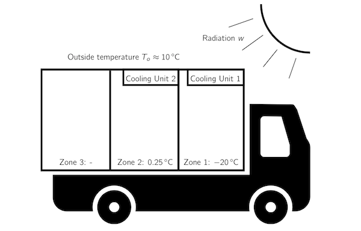

# mpc_climate_control

Model Predictive Control Algorithm for temperature regulation of a delivery truck

In this project you will implement an MPC controller for the temperature regulation
of a delivery truck with three temperature zones, two of which are equipped with
cooling units to regulate the desired temperatures. The truck is illustrated in
Figure 1 and consists of the following zones.

* Zone 1 Deep freeze temperature zone at −20◦C for frozen goods actuated by
Cooling Unit 1. In order to ensure food safety, the temperature may not
exceed −16◦C at any time.
* Zone 2 Cooled temperature zone at 0.25◦C for fresh goods actuated by Cooling
Unit 2. The temperature shall never exceed 3◦C. Additionally, freezing
temperatures below 0◦C must be avoided at all times.
* Zone 3 Unregulated temperature zone for non-perishable goods.

Each zone is equipped with a sensor providing the current temperature of the
respective zone. The system is actuated by cooling units in Zone 1 and 2 with
different capacities.

* Cooling Unit 1 Provided cooling power between −2500 W and 0 W
* Cooling Unit 2 Provided cooling power between −2000 W and 0 W

Your task is to design a temperature controller for the delivery truck, which
tracks the desired temperature and satisfies the food safety constraints at all times.

