# Taxi_Price_Prediction

# Abstract
The aim of this assignment was to predict the taxi fare with the goal to minimize the RMSPE. In doing so, we adopted a combination of system theory, machine learning models and feature engineering. The final model was able to predict the final price to RMSPE=0.2415.

# Problem description
The goal of the underlying project is to build a statistical model that is capable of predicting the price of a taxi journey based on the start/end coordinate, the time stamp at start as well as the identity number of the taxi driver. For simplicity the price of a journey is defined as the sum of its duration and the travelled distance

$$FARE = DURATION + TRAJ\_LENGTH$$

To train the model $465172$ labelled examples are given, consisting of the taxi-id, the time stamp, coordinates recorded every 6 seconds during the taxi journey as well as a ground truth for the duration and trajectory length, all located in a limited area ($\Delta x = 1204$, $\Delta y = 900$). As an evaluation metric for this regression problem functions the Root Mean Square Percentage Error. It is defined as

$$ RMSPE = \sqrt{\frac{1}{N} \sum_{i=1}^N (\frac{p_i - t_i}{p_i})^2} $$

with $p_i$ as the prediction and $t_i$ as the real value of the resulting price of a taxi journey for example sample "i". 

# Solution overview

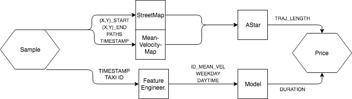

Price prediction is split into two parts, namely the trajectory length and the duration. The prediction of the trajectory length is based on the start and the end point and hour of the day which a journey commence ("map prediction" in fig. \ref{fig:prediction_chain}), which gives rise to an estimated trajectory and path. As shown below the trajectory length is correlated to the coordinates of both start and end points, the duration and hour of the day (HOUR). Thus, removing  TAXI-ID and the DAY does not lead to a large loss of information and therefore a huge inaccuracy in trajectory prediction. A description of the AStar optimal path to predict the trajectory will be provided in the subsequent section.

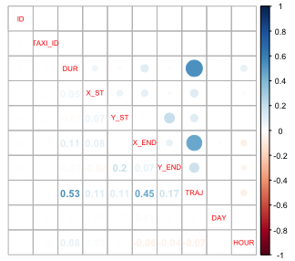

For the purpose of estimating the duration of a journey, the prediction of the trajectory cannot be used, as it would amplify the error of the prediction. Instead the approach will strongly depend on the other features, including the euclidean distance. The workflow of predicting the duration essentially was to try a feature by 10-fold cross validation and discard the predictors that were not successful. We will emphasize on the features that were used in the final prediction

# Map Prediction
As the prediction of the trajectory length should not only output the trajectory length but also the trajectory itself, the model has to deal with different sizes of output and must be capable of estimating the whole trajectory based on less input data than resulting output size. As shown later on most of the standard models (such as linear regression or neural networks) do not perform well for this problem, since both input and output space are quite large. Thus the prediction is based on standard path finding algorithm, that do not require many training effort but still able to come up with a reasonable performance. Nevertheless, every path finding algorithm needs a cost estimate of every node of its graph. In order to determine these costs, the underlying algorithm uses a street and velocity map. 

## Street Map
The street map introduces the "permitted" path points to the algorithm. To build the map, the number of occurrences of every coordinate in the area is counted in the start/end points. Together with its respective trajectories, the following map was plotted. 

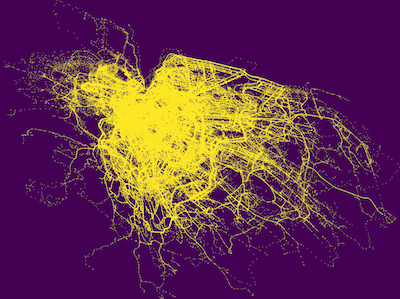

However, the obtained map looks unstructured and crowded. On reason can be attributed to the effect of inaccurate GPS measurements in the data. A prediction based on this map would not perform much better than approximating the trajectory length with the euclidean distance. Thus, several filters have to be applied to structure the map: 

1. Multiple hits: There are many points which appeared only once (or very rare) in the map, i.e. the counter is small. Because of the large amount of data (especially compared to the relatively small amount of possible coordinates) it is very probable that a "street point" is hit several times. Hence, every coordinate that occurred less than 20 times in the trajectories is regarded as noise. 
2. Pooling: For a well-performing local path finding algorithm continuous (i.e. connected) streets are essential to separate street from environment points while moving in a certain direction. Thus, next to multiple hit filter, a pooling filter is applied, labelling merely these points as belonging to a street that have at least 3 neighbours with high occurrence. In doing so "noise cluster" and lonely islands in the environment are filtered out, while connected street points remain. 

After filtering and cleaning, we obtained a much more "meaningful" street map result, in a way such that the downtown area, highways etc. can be separated. 

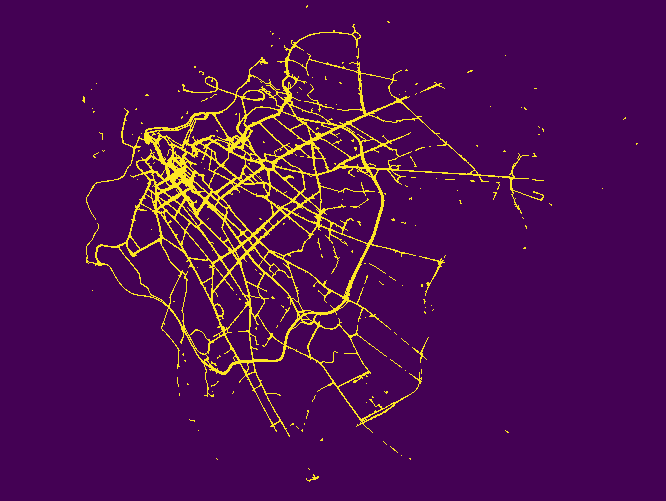

## Mean-Velocity Map
Using merely location-dependent cost is insufficient to approximate the underlying problem since the time whereby a journey started will make a difference. Besides, the boolean street map does not indicate which streets are preferred. The downtown area has low speed while the highway "circle" around the downtown area allow vehicles to move faster and thus is more likely to be chosen by the taxi driver. Hence, a map is needed to contain information about the driver's preferences broken down by the journey's starting time point. Assuming that the duration of the journey is minimised, the driver will decide to choose "high-speed" roads whenever possible. Hence, a time-dependent velocity map is created as heuristic for the driver's preferences. 

|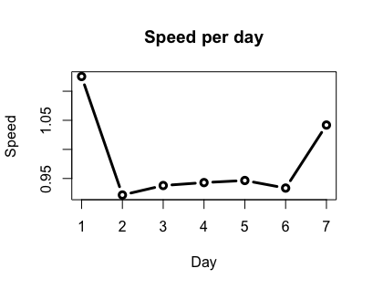| 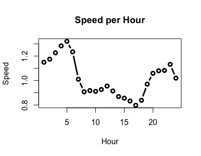 |
|:---:|:---:|
| Speed per Day | Speed per Hour |

As shown above, the mean velocity is heavily dependent on the hour and not on the day, except during weekends. However an accurate and meaningful estimate of the velocity in every map point is crucial, therefore the map is chosen to be merely hour-dependent, not day-dependent, since a trade-off between the generality in terms of number of data used to create one map and the specificity of the map had to be met. One of the resulting velocity maps (HOUR = 12 pm) is shown above, highlighting areas of large mean velocity. 

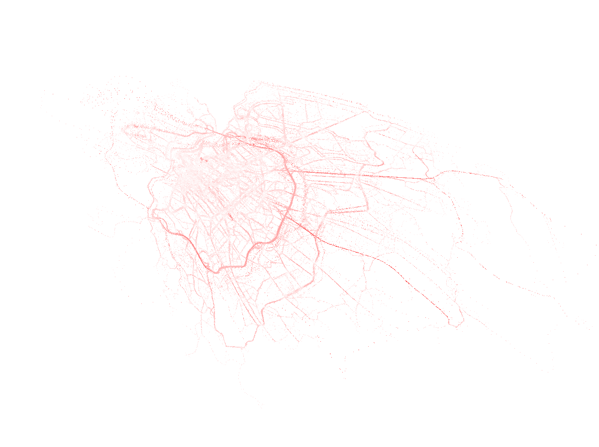

Even if the velocity map looks quite similar to the previously derived street map, both of them essential. However, it is to note that the street map is more accurate in terms of the real location of street points due to applied filtering. In path finding procedure, the direct neighbours of a given street point are determined by using the street map. Since the following algorithms are constrained by staying on the street in the first step, the starting and ending points are replaced to the closest street point by using a uniform cost search algorithm, when they are not on the street initially.     

## Local Optimisation
As a first approach, we used the steepest descent method (local optimisation) to calculate the path from the start to the end point, due to the fast computational speed. Therefore, beginning from the start point, neighbours of the current point in distance of the step width ($=5 [m]$) are determined and for every valid neighbour, a cost function is introduced. The neighbour with the smallest cost is taken as the next node, until the end point is located within the termination distance ($=10[m]$). The total distance between every trajectory point, the reset distance and the distance to the end point when the algorithm terminates ascertain the trajectory length estimate. 

$$c(\vec{x}) = \beta_1 ||\vec{x} - \vec{x}_{end}|| + \beta_2 \rho(\vec{x}) + \beta_3 \langle \vec{x} - \vec{x}_c, \vec{v} \rangle$$

The cost function has to take care of a fast convergence, but also of moving merely on the streets and in a reasonable manner. As a consequence the cost function is a weighted sum of three elements

- Distance to end: To ensure that a nearly optimal solution in terms of minimising the necessary trajectory length and the distance of each candidate to the target (end) point is taken into account. 
- Conservation of movement direction: Since a vehicle cannot change its moving direction abruptly, to include this constraint into the optimiser, we applied a scalar product on the vector pointing from the current to the candidate point along with the current movement direction. As a consequence, extreme changes in moving direction (e.g. rotation by 180 deg) are minimised and reaching the local minima by switching between the same points is prevented (as a movement change would be necessary). 
- Mean Velocity: As shown above the optimal trajectory depends on the starting time. In addition, with reference to fig \ref{fig:velocity_map} the behaviour of taxi drivers in terms of speed is not uniformly distributed over the map. To take these information into account, we tried to maximise the velocity during the optimisation process. 

The underlying approach turns out to perform well, especially since no hard limiter are used, such that (in "worst" case) an error in the street map (e.g. not perfectly connected streets) could be compensated by moving into the environment for the sake of minimising the distance to the end point, but on the other hand preventing to do so when other reasonable "options" occur. Nevertheless, as most of the local optimisation algorithms, the algorithm is vulnerable to get stuck in local minima, which is likely to arise in case of long trajectories. Hence, to prevent an overestimate of the resulting trajectory length, the algorithm checks the above mentioned problem by comparing the current point with the previous points. The remaining trajectory is estimated by euclidean distance should anything goes wrong. The weights are found by using a randomised parameter search 

$$\beta_1 = 0.72 \hspace*{1cm} \beta_2 = 1.0 \hspace*{1cm} \beta_3 = 0.43$$

The approach described above improves the accuracy in the prediction of the trajectory length, compared to a basic euclidean distance estimation. Due to time constraint and to prevent overfitting of the model, the regression error is defined for a random subset of the training data (N = 2000)

| RMSPE          | Euclidean | Local Search |
|----------------|-----------|--------------|
| all            | 0.39      | 0.35         |
| TRAJ_LEN < 400 | 0.36      | 0.15         |

As previously mentioned, the probability of being stuck to a local minima increases with growing distance between the start and end point, such that the euclidean approximation evolves more frequently for increasing trajectory lengths. Unfortunately, the euclidean distance underestimates the trajectory length, thus the estimate becomes less accurate when the trajectory length increases.

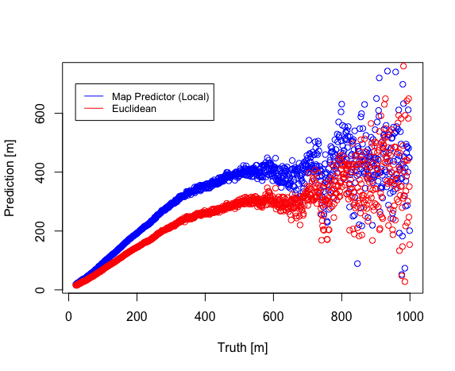

## AStar Path Finding
A commonly used algorithm for path finding (e.g. Google Maps) is the AStar algorithm, that is capable of finding the optimal (i.e. smallest distance) trajectory given a graph of nodes. Starting from the initial node every node in the neighbourhood is visited and registered in a priority queue that is ordered by the  node's full cost. As AStar is an extension of the Dijkstra algorithm, the full cost of a node is not merely composed by the distance to the initial point but also by a heuristic function that estimates the remaining cost from the node to the target point. After visiting the neighbour node of the initial node, the node with the lowest cost in the priority queue is expanded such that it freezes (i.e never visited again as the optimal path to this node is known now) and its neighbours are visited, until the target point can be reached in a terminal distance. It can be proven that the AStar algorithm always derives an optimal solution when an admissible heuristic \footnote{For every node $N$ the cost of reaching the target state from node $N$ must not be overestimated, i.e. $h(N) \leq h^*(N)$, with optimal cost $h^*(N)$.} used. However it is assumed that the trajectory is chosen by the taxi driver such that the time is minimised. Thus, the optimal path is determined by minimising the required time from the start to the end point, which is based on the velocity in every map point. Hence, with $V(\vec{x}_j, h)$ the velocity at point $\vec{x}_j$ at time $h$ we want to find the optimal path $\phi$ from starting point $A$ to target point $B$ from all possible paths $\Phi_A^B$.

$$\phi = \min_{T} \Phi_A^B$$
$$\text{with } T_{\phi} = \sum_j^J t_j = \min_{T} \sum_j^J \frac{||\vec{x_j} - \vec{x}_{j-1}||}{V(\vec{x}_j, h)}$$

To do so the cost is defined the required travel time $t = \Delta x / \Delta v$. The heuristic must give a hint about the remaining cost to the end node but must not overestimate its (admissibility), therefore it is defined as the euclidean distance to the end point divided by the maximal velocity in the map. Hence the total cost $f$ of path element $K$ is defined as 

$$f_K = \sum_{k=1}^K \frac{||\vec{x_k} - \vec{x}_{k-1}||}{V(\vec{x}_k, h)} + \frac{||\vec{x}_{end} - \vec{x}_{K}||}{v_{max}}$$

Even if the optimal path is determined by AStar, the path could be underestimated since the driver does not always choose the optimal path, e.g. due to "unusal" traffic. The following example shows the predicted vs the true path, while the prediction represents the optimal path in terms of duration (and length as the velocity map is roughly uniform in the journeys area) the true path is completely different, resulting in a large underestimation of the trajectory length. 

| 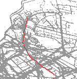 | 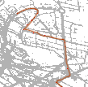 |
|:---:|:---:|
| Predicted path | True path |

The non optimality of the real path due to conditions that are not reflected by the cases is more probable in the event of longer distances, thus the performance drops for higher trajectory lengths, as shown below. Compared to the previously described local search approach, the AStar algorithm provides several advantages: Since the previously visited nodes are stored in memory (priority queue and node's state) the algorithm cannot get stuck into local minima by revisiting states several times, a "wrong" decision in one place can be corrected later on. Besides, the algorithm always finds the optimal solution in the given problem definition, i.e. there are no weights to train (and thus no possibility to overfit), since the choice of heuristic function may solve a given problem faster without affecting its performance. 

| RMSPE          | Euclidean | AStar Search |
|----------------|-----------|--------------|
| all            | 0.39      | 0.31         |
| TRAJ_LEN < 400 | 0.36      | 0.08         |

As a consequence, the prediction accuracy improves (shown above). In case of distance < 400 the prediction is nearly perfect, however, for larger trajectory length, it is diverging as well (0.31 RMPSE overall). 

| Method              | RMPSE (overall)|
|---------------------|----------------|
| AStar               | 0.31           | 
| Linear Regression   | 0.73           | 
| Neural Network(n=6) | 0.57           |
| SVM                 | 1.29           |
| Random Forest       | 0.29           |

The underlying model is capable of estimating the trajectory length using positional and time related data, without being trained and outputting not just a scalar value that is hard to understand (no black box !), at the cost of computational complexity in both space and time \footnote{The AStar path finding requires 33 ms per prediction while local search requires roughly 0.8 ms, tested with a Apple Mac Pro 2015.}. As shown above it performs a lot better compared to most of the common regression approaches, as linear regression, neural networks, etc. Although a random forest comes up with a comparable small error, it does not provide path points and is susceptible to overfitting due to the necessity of training. To further improve the estimation accuracy, a more "personalised" cost and a estimate of "live" traffic would be necessary. However, predicting the full price directly is challenging using AStar, since it does not take the behaviour of each driver into account (but deals with average data).

# Duration Prediction
It is important to note that the prediction of the duration is subjected to a lot of variance that is not extractable from the data set. E.g. taxi drivers perception of the best route, traffic lights, various road usage etc. The question is how well this noise can be reduced.

## Data cleaning and transformation
The data set needs to be cleaned from minority samples that disturbs the prediction of the majority. In the columns X_TRAJECTORY and Y_TRAJECTORY  points reappear, indicating that the car for some reason is standing still. Some samples declare the car is stationary for more than 30 seconds(some more than 60 seconds), which is not the typical nature of a taxi ride and these samples are discarded.

Furthermore the feature TRAJ_LENGTH is replaced by the primitive euclidean distance, in order to have a feature that is consistent for the training data and the test data. By looking at the boxcox-plot of TRAJ_LENGTH, the conclusion is that the data is skewed and a transformation should be used.

The Boxcox plot suggests that the relationship between TRAJ_LENGTH vs DURATION has $\lambda \approx 0$, indicating that a log transformation is at place. New features: LOG_TRAJ_LENGTH and LOG_DURATION were derived. 

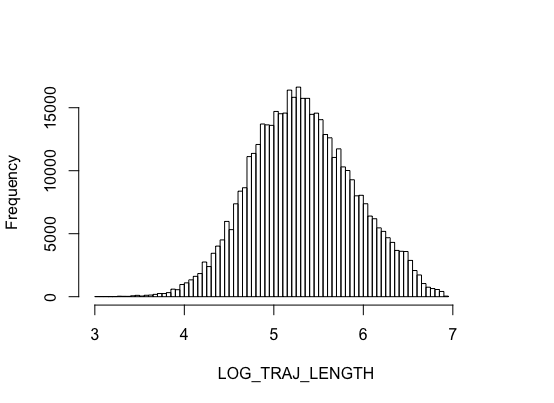

Samples that highly vary from the mean are not contributing to the majority of the predictions, hence the dataset is reduced by removing most of the samples (roughly equivalent to 1% of the data). 

## Feature engineering
Having reduced the data, a fairly accurate mean velocity estimate can be made and, giving birth to the feature LOG_AVG_SPEED by dividing LOG_TRAJ_LENGTH with LOG_DURATION. As a basic step, the easily accessible data is extracted. I.e. breaking out new features DATE, MONTH, WEEKDAY, TIME_OF_DAY from TIMESTAMP. Also, the aggregated mean speed for each TAXI_ID is binned into 20 normalized categories(called SPEED_CAT). It is a very rough categorisation and hence the mean speed will also be recalled as a numerical feature in the data set, ACTUAL_TAXI_SPEED. 
Next the hypothesis that some areas are quicker than others, is tested. This makes sense, considering roundabouts, turns, intersections etc. By looking at the cases where the taxi stands still for each and every point in the trajectory, we are able to get a comparable constant that could interpreted as a sort of most probable waiting time at a certain coordinate. The waiting time is calculated by first finding where the taxis are standing still and then calculating for each point the mean of its' waiting time and its' 121 closest neighbouring points. A large matrix is created that includes all points that occur a significant amount of time in the data set. This matrix can be plotted as a sort of speed plot. In the model the features MEAN_END_AREA_SPEED(MEAS) and MEAN_START_AREA_SPEED(MSAS) are derived from this map, taking values from the start and end location of the taxi ride.

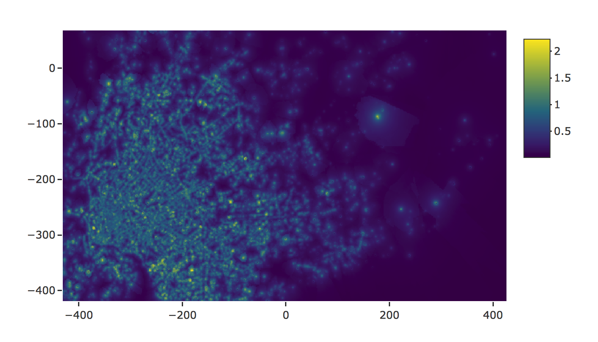

The significance of the latter two models should be motivated and that is done by running a 3 times 10-cross validation over the same training set using the same folds for each set of features. The average results are found in the table below, XGB was used to fit the model.

| Set of features         | MAPE      | RMSPE        |  
|-------------------------|-----------|--------------|
| Full set                | 0.2327    | 0.3363       |
| Excluding MEAS and MSAS | 0.2494    | 0.3616       |

In a further attempt to extract features that explain the journey in terms of speed, we evaluated the velocity map further. By knowing that the features regarding trajectory gives an output every six seconds, we were able to get an average speed. This gives a mapping that we can integrate over. As the actual trajectory is unknown, an alternative hypothesis is tested: that there exist some area between the starting point and the end point, that describes every possible sane route between the points.  None of the patterns tried gave us a significant result. This would be an example of a feature that is discarded in the final model. 

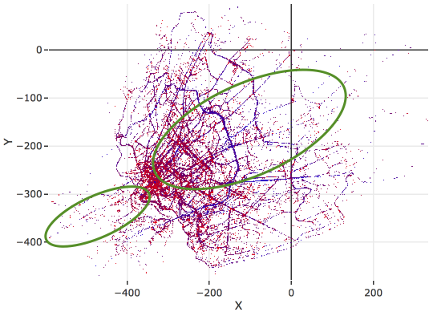

# Overall Results
The final model was created by letting AStar predict the distance for euclidean distances below 400, and we made used of random forest for samples with greater euclidean distance. While simultaneously using random forest to predict the duration, using features described in section 4. The result of running this method is presented in the table below.

| MAPE         | RMSPE      | Miscellaneous |  
|--------------|----------- |---------------|
| 0.1931       | 0.2173     | 10 CV         |

# Members 
- FAN YUECHEN
- WONG ZHEN NING, VIVIAN
- MIYATA SHUSUKE	
- SIMON HUBERTUS SCHAEFER	
- GUSTAV HANS OLOF FREDRIKSSON	
