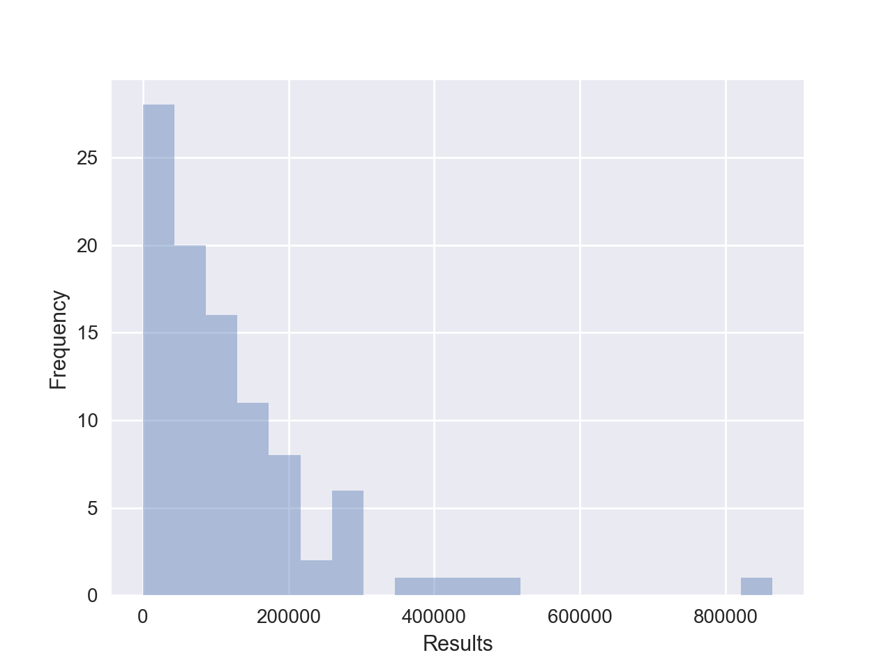
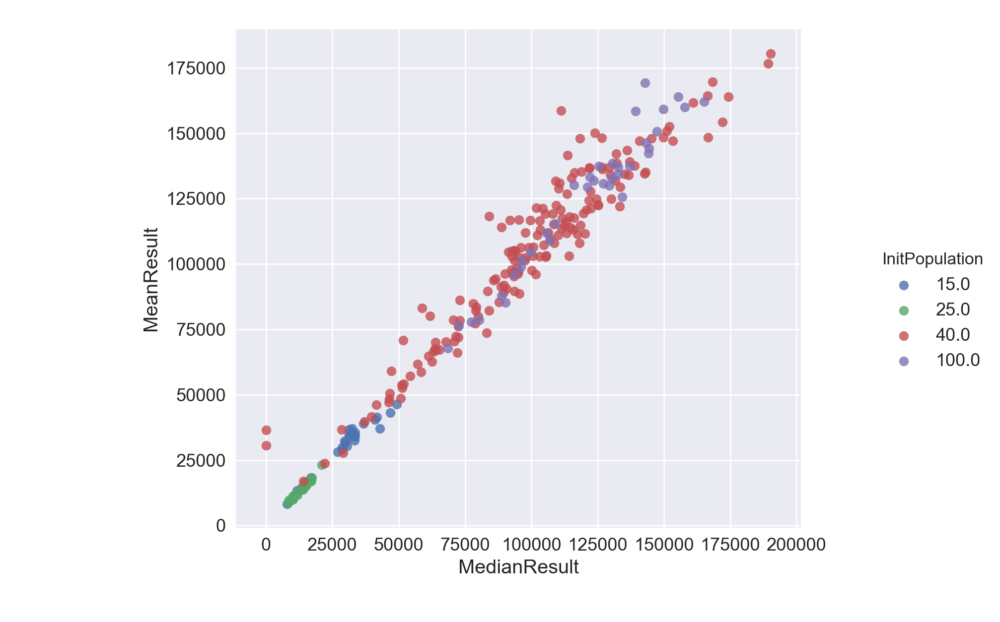
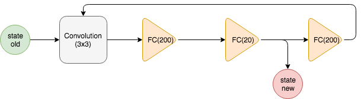
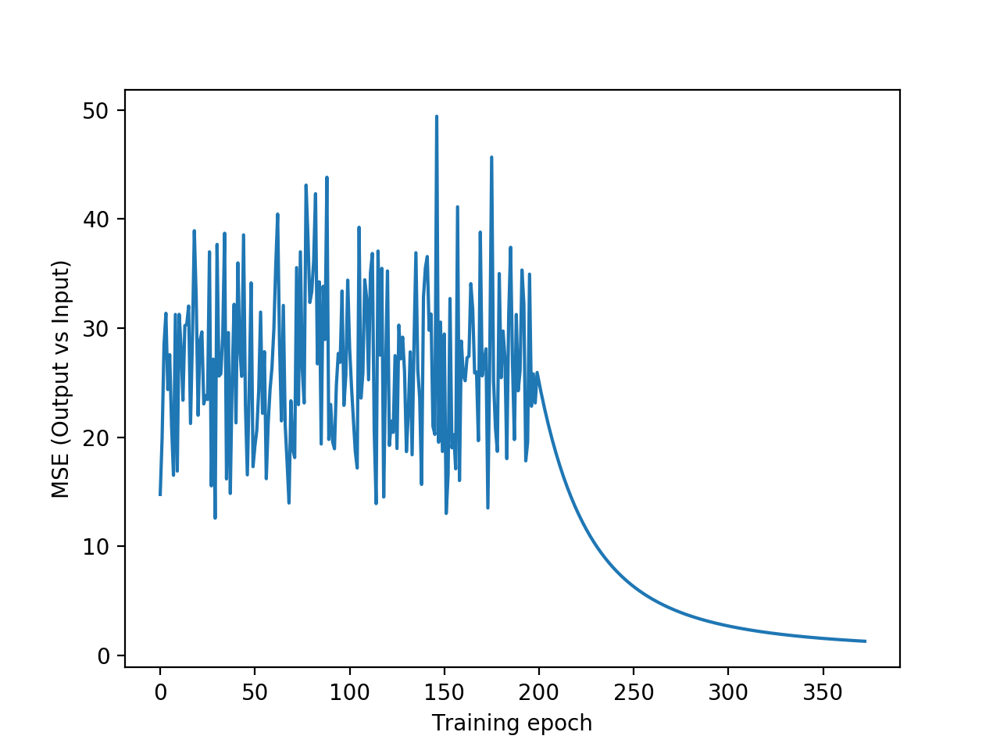

# Abstract
**This report is about the challenge of designing an utility based agent which can maximize the number of rows cleared in the game of Tetris. We achieved the best performance using a genetic algorithm but also present other approaches.**

# 1 Introduction
The game of Tetris has seven distinct block shapes (Tetraminos), which can be manoeuvred by translation or rotation. The ultimate goal is to place the Tetraminos such that the number of cleared rows is maximized and that, in theory, the game never terminates.
The Tetris game is fully observable since the complete board is known at any point in time. It is sequential and static, as the orientation of Tetraminos merely changes as a consequence of the player’s moves. The game is discrete as it acts in a discrete 20x10 grid. Though each action is deterministic, while the choice of the next Tetramino is randomly distributed over all seven shapes.
The next player move can be determined using a utility based agent. Its utility function is a weighted sum of different features of the board for a given state, which can be determined using genetic algorithm. The following section gives a detailed overview of our implementation.

# 2 Genetic Algorithm
Genetic algorithms are search algorithms based on the mechanics of natural selection and genetics as observed in the biological world. They use both, “survival of the fittest” and ”mutation” (randomization) to robustly explore the best choice of weights.

## 2.1 Features
To determine the next move, all possible move are compared using a utility function and the move resulting in the highest utility is chosen. The utility function is a weighted sum of different, state-dependent, human engineered features. A ”good” choice of features therefore is crucial in order to obtain a well-performing agent.
The current state is defined by the occupancy of the board and the next Tetramino. One can also define abstract state descriptors like the height of columns, holes, wells and transitions. A hole is an empty cell with an occupied cell above it. A well is a column whose adjacent columns are higher than it, and its depth is defined
as the difference of the height of well column and the shorter adjacent column. Transitions are the number of empty-occupied cell switches in the respective column or row. The final set of features we used are:
1. Sum of height differences between adjacent columns.
2. Maximum height of a column.
3. Total number of cleared rows.
4. Whether the current move results in a loss.
5. Total number of holes.
6. Sum of depths of all wells in the game board.
7. Mean of the absolute difference between the height of each column and the mean height

## 2.2 Training Algorithm Implementation
In order to find an optimal set of weights, several steps are repeated iteratively: First, an initial population of randomly drawn weight vectors from a uniform(0, 1) distribution is generated.
To produce the subsequent generations, we first choose a parent in the following way: We calculate the sum of scores of all members of the previous generation and multiply it with a random number from a uniform(0,1) distribution to define a threshold value. We then randomly draw members from the previous generation and check if their score crosses the threshold value. If it does, we choose that member as as a parent. Else we reduce this threshold and continue the search by drawing a different member from the population. In case no member of the previous generation crosses the threshold, we return the member with the highest score in the previous generation as the parent.
After selection two parents using the above method, we use the single point crossing over heuristic to determine the weights of the two children produced. In this heuristic, a single crossover point on both parents’ weight sequence is selected. All weights beyond that point in the parents’ weight sequence is swapped between the two parent organisms to generate the two children. We used a 0.6% crossing-over rate. The rate defines the probability for the crossing over to happen. In case crossing over does not happen, the parents chosen are directly passed as children to the next generation.
Subsequently, each weight of the child can undergo mutation with 1% probability. If a mutation occurs, the spe-
cific weight is multiplied with a uniformly drawn value between 0.8 and 1.2.

## 2.3 Parallel Processing
Due to the randomness in the choice of next stone, each game is different. In order to avoid ”overfitting”, i.e. a set of weights merely performs well for a specific sequence of stones, the score for each member is the average score of 10 games. As these games are independent from each other, they are played in parallel, using multi-threading. Similarly, each member of the population has its own set of independent feature weights and hence, they are also evaluated leveraging multi-threading. This achieves a speedup of roughly 10.82, e.g. given a population size of 50, the multi-threaded version needs 7m53s per generation while the older version needed 85m19s.

## 2.4 Results
We analyze the results from 100 runs of the game using the weight vector w⃗ shown right below, which were derived training our best genetic algorithm for 200 generations with a population size of 40. The weights of the features are ordered as in Section 2.1.
w⃗ = 􏰀0.69, −0.60, 0.80, 1.07, 0.68, 1.13, 3.63􏰁
Figure ?? gives us the distribution of the performance results from 100 iterations. We observe that while most results are below 100,000 rows cleared, there are 10 iterations where we clear more than 200,000 rows.
Table 1: Performance of best weights over 100 iterations
Table 2 shows us that the while the minimum number of rows cleared is 101, we clear a maximum of 864,157 rows. The average number of rows cleared is 119,560 which is clearly higher than the median of 82,706. This aberration is due to our extremely well performing runs when the sequence of incoming stones is very beneficial to our set of weights.
Figure ?? shows that there is a linear relationship between the mean and the median of the 10 best results of each generation during training. This means that we don’t get random outliers of weights which give good scores for very few members while all others perform poorly. Instead we have a smooth development and increase of the performance during training. Also, the graph shows that the mean scores during training are lower for population sizes of 15 and 25, and increases significantly for population sizes greater than 40. The performance tends to converge for population size 40, as
there isn’t any improvement with population size 100. This means that the population size has to pass a certain threshold such that the random processes of crossing over and mutation are likely to ”produce” significant improvements.

Figure 1: Results from 100 iterations of the game

Figure 2: Mean-Median plot of intermediate scores during training for different population sizes.

# 3 Further Experiments

## 3.1 Additional Features
We tested out several other features, but discarded them later as they did not improve results. They were:
1. Number of connected holes.
2. Difference between maximum and minimum column height.
3. Maximum depth of well.
4. Number of blocks currently present on the board.
5. Weighted number of blocks, where you penalize blocks in proportion to the height at which it is located.
6. Number of Horizontal transitions. 7. Number of Vertical transitions.
    Metric
hline Average
   Value
119,560
   Median
  82,706
 Maximum
  864,157
 Minimum
  101
    
## 3.2 Other heuristics for crossing over
We experimented with some other heuristics for performing the crossing over of the two parents to generate the child :
1. The child randomly picks the full set of weights of one of its parents
2. The child’s weights are average of weights of the parents
3. For each feature, the child randomly inherits the weight from one of the parents
4. Generate a random number k, and the child takes the first k weights from one parent and the rest from the other
However, we got a maximum of 86,516 cleared rows with these other heuristics and thus discarded them. Graphs for analyzing performance of these heuristics can be found in the appendix.

## 3.3 Particle Swarm Optimization (PSO)
PSO is a computational method that iteratively tries to improve a candidate solution with respect to a given measure of quality. At each iteration, it keeps track of the best feature weights for every population member, and also for the entire population. We modify the weights at each iteration, influenced by the best weights for that member as well as for the entire population, using the velocity vector for each feature, and update them in case a personal best or global best set of weights is found(which clears the most number of rows). This optimization directs the movement of weights of the future generations based on memory of best performing members of the previous generations. This helps converge the current genetic agent candidate towards the most optimal one found so far.

## 3.4 Other Algorithms
Using a genetic algorithm is capable of finding a wellperforming solution but still heavily depends on the features engineered by humans. Thus, we tested data-driven algorithms in order to eliminate the necessity of human feature engineering.

### 3.4.1 Q Learning
Q Learning is a kind of reinforcement learning, that does not require a model of its environment. For each game state (s), Q Learning maps all possible actions (a) to rewards Q(s, a). The Q function’s values for each pair (s, a) is derived during training procedure, using the Bellman equation [?]:
Q(s, a) = r + γ max Q(s′, a′) a′
Meaningly, the reward for taking action a in state s is the sum of the initial reward of this action (r) and the weighted reward of the next state s′. In order to get a Q value for all actions in every state, during training time, a random action is chosen with probability ε = 0.4. Otherwise, the greedy policy determines the action. The training is terminated when all of the Q-values converged. This might include to have a decreasing learning and random move picking rate (γ resp. ε).
The Q-learning approach is therefore in need of a reward function (r) but in contrast to the genetic algorithm approach this is very intuitive e.g. for Tetris, r = −1 if the game has ended and r = 0 otherwise is sufficient, or for CTB,r=1iftheballwascoughtandr=−1iftheball passed the catcher (see chapter ??).
Therefore the Q learning method is capable of playing any game without any a priori knowledge about the environment, only terminal state games have to be assigned a ”reward”. Nevertheless a lot of training iterations are necessary until all of the Q values converged and have been updated at least once. While this does not pose a problem in case of small states and action spaces, as in the CTB game with O(102) possible pairs, indeed the Q learning training procedure is infeasible in case of large state spaces. The Tetris as characterized in ?? has 2200 = O(1060) states. Even if one training iteration would take less than a nanosecond and the algorithm would never revisit states updating every entry in the Q matrix would require roughly 1043 years. It can nevertheless be shown that the Q learning approach works in the Tetris frame. For a simpler version of Tetris 1 the Q values converged after 10000 iterations and afterwards the agent clears an infinite number of rows. Thus, to solve the ”standard” Tetris game with a Q-Learning approach, the challenge is to narrow the state space dramatically and reasonably.
For the purpose of shrinking the state-space several approaches were tested. Most of our approaches resulted in a too large loss of information and consequently to a very bad performance of the agent (e.g. redefining the game’s state as the top (two) rows of the board).

### 3.4.2 Auto Encoder
High-dimensional data can be converted to a lower-dimensional representation by training a multilayer neural network. This network (see figure ??) is symmetric with respect to the small central layer (whose output is the encoded input). Therefore the first part of the network encodes the data, while the second one decodes it and the resulting error is used to optimize the networks’ weights ([?]). In the Tetris game an auto encoder can be used to encode the field (state) and replace it by a low-dimensional column vector.

Figure 3: Auto Encoder Architecture

To represent the Tetris board in a lower-dimensional space the adjacent structure of every cell (e.g. holes) could be important. Hence, the board is convoluted first and the convoluted board is fed into the autoencoder which consists of three fully connected layers, downsampling to a vector of size 20, and is trained using batch normalized stochastic gradient and subsequently steepest gradient descent, to avoid getting stuck in a local minimum. For building and training the network the encog framework was deployed.

#### Auto Encoder in Genetic Algorithm
Instead of manual feature engineering the features could be derived by learning a shrunk state representation, i.e. by using the auto encoder’s state directly. We used our CTB implementation to first verify this new general idea. To perfectly perform in the CTB game merely the distance between catcher and ball is necessary as a state, a full state description is given by the distance and a position of either the catcher or the ball (merely x-coordinate regarded here). In theory the game’s internal state, i.e. two hot-encoded vectors containing the discrete x-position of both catcher and ball, should be down-sampled to this smallest possible state description. Unfortunately, applying an autoencoder to the CTB game results in two values that are not separately dependent on either the distance or position but contain a combination of both. Thus, even if the encoder’s output well defines the game’s state, it can nevertheless not be used as feature vector, since the agent’s decision should surely not be affected by the absolute position of catcher/ball in the CTB example. In general the previously described problem arises as well when applied on the Tetris game. Hence, the genetic agent trained with autoencoded features did not perform well for the two games.

# 4 General Agent
Another goal of our project was to design the agents in a general style such that they are not limited to only playing Tetris, but can be easily deployed and tested on CTB or any other game which is implemented in line with our abstract (general) game class. The roadbloack here is that we have not yet found an algorithm which can automatically calculate reasonable set of features. Therefore human ”feature engineering” will still be required.

Figure 4: Auto Encoder Training errors

# 5 Discussion
Future improvements include making the genetic agent more robust by looking one move ahead and factoring that in to decide the best current move. Also, one could try to find a state space representation suitable for playing Tetris with the Q-Learning approach. Overall, we are pretty satisfied with our results, especially considering the amount of time and effort we invested in exploring the Q-Learning and the Autoencoder approach. We were able to scale our algorithm to use big data, since the genetic algorithm has an inherent structure for parallelization. Our implementation using multithreading was able to execute 86 generations of the genetic agent with a population size of 100 in about 5 hours using the 10 cores on the NSCC cluster achieving a mean cleared rows of about 118,587.
The genetic algorithm and PSO optimization parameters required extensive tuning, and given the limited time, we focused on tuning the heuristics for crossing over and mutation rate, along with different population sizes, since this helps in achieving a better population in fewer generations. We also tried tuning the weights of velocity and coefficients of influence of the local and global best results for the population using PSO. But this only led to marginal improvement in results. The genetic algorithm evolves quite steadily, but slowly in the solution space, while the PSO occasionally gives good results. Hence, we thought of combining the two so that any good set of weights in the solution space obtained randomly could be converged upon. This is evident of the fact that genetic algorithm tends to localize to a suboptimal solution and exploit the solution space, while PSO tends to explore it. A higher velocity coefficient explores the search space more. So, the search problem is essentially balancing between exploitation and exploration, which could have been improved by applying PSO on a fraction of the population. We observe a large variability in the results, as is inherent set of random weights of the population and velocities in mutation, selection threshold of parents and initial imparted to the features.

# 6 Authors

Svilen Stefanov: Svilen-Stefanov / svilen.ks@gmail.com

Madhav Goel: madhav-goel

Arijit Pramanik: Arijit-hydrated

Simon Schaefer: SeleSchaefer / sischaef@student.ethz.ch

Niklas Funk: nifunk / nfunk@student.ethz.ch
